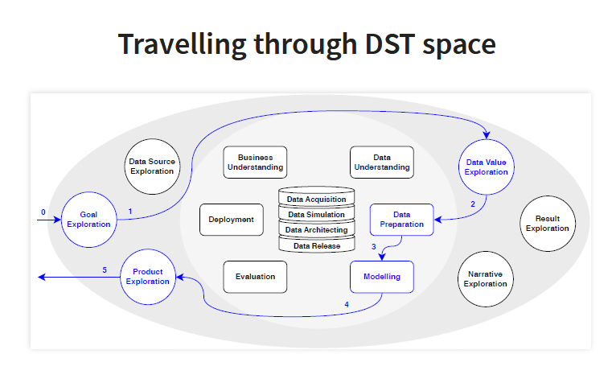
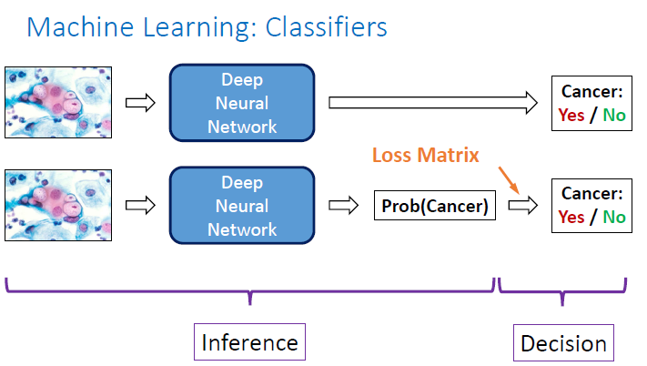

Last September, I had the opportunity to participate in the  **EXPLAINABLE DATA SCIENCE**  summer school in Kirchberg, Luxembourg. the summer school was organized by the European Association for Data Science (**EuADS**) and was held during 10-13 September.

What I specifically liked about this summer school ( of course besides enjoying the the beautiful city of Luxembourg ) was the fact that it covered a vast variety of topics in the explainable machine learning (AI) literature, ranging from visualization, XAI techniques, causality to psychological aspects of explainability.  In addition, the summer school has a special guest, the legendary **[Christopher Bishop](https://www.microsoft.com/en-us/research/people/cmbishop/)** who gave the **inaugural** lecture.

You can find the complete program and the presentations in the [EuADS's website](https://euads.org/summer-school-2019/). Nevertheless during some presentations in the summer school, I took notes and I summarized them. 

> **Disclaimer:**
>
> Sometimes it is not easy to keep up with the speaker and take notes. Also, it is possible that what I wrote down is just my interpretation and not what the speaker intened to say.  For this reason, I do not guarantee that all details in this post are accurate or what the speakers wanted to communicate.
>

## From Data Mining to Data Science - Peter Flach (EuADS President)

### 1. What is Data Science?**

"Data Science" is a vague term. One might mean by "data science":

1. It is the Science of data. This definition is more frequently used by statistician and machine learning and is more theoretical.
2. Doing science with data. This definition is more applied and data intensive.
3. Applying science to data. This definition is also heavily applied and data intensive.

**Data is not the New Oil**

Some people are overexcited about having access to huge amount of data as if they have discovered an oil field. Likewise,  they believe that they can simply extract value from  data and this data is a new driver for progress and prosperity. However, even if we **acquire** data we cannot be certain that it is valuable and we can extract value from it.  

In other words, data in and of itself does not present value:

data != value but 

But data and knowledge together can result in value. Here knowledge can be an input or an output of the data. 

data + knowledge = value

Now data science can defined as follows:

It means that Data Science has three main ingredients:

1. ** Data **
2. ** Knowledge** 
3. ** Value **

The kinds of value that Data Science can generate are:

- scientific knowledge and models
- societal value
- economic value
- personal value

### 2. From Data Mining to Data Science

Many consider data mining to be the father of data science. Others  say that data mining is a subset of data science. While the interest for data mining is declining,  data science gain more popularity.

*Fig. 2: Data science is getting more popular than data mining*

*Fig. 3: CRISP data mining process*

In data mining, we (implicitly) assume that there is some value in the and  our aim is to use data mining techniques to **uncover** it.  We can see data mining just like the extraction of a valuable metals from an existing mine.

However, in data science, we first need to make sure that data has some value. In other words, data science can be seen as prospective, which means we are searching for a mine to extract metal material from it. That puts more emphasis on the exploratory aspect (nature) of data science, which includes the following activities:

These activities do not exist in the data mining space and distinguish data science and data mining.

*Data Science Trajectory (DST) space*

Data mining is a more sequential and more prescriptive approach where every operation must be implemented in a specific order. All activities in data mining can be a part of a data science project but not the opposite. For instance, not every data science project *requires* a modeling phase. On the other hand, the goal of data science  for a specific application can be just data collection or data publication.

Read more about this in the following paper:

> **CRISP-DM Twenty Years Later: From Data Mining Processes to Data Science Trajectories**. Fernando  Martinez-Plumed, Lidia Contreras-Ochando, Cesar Ferri, Jose Hernandez-Orallo, Meelis Kull, NicolasLachiche, Maria Jose Ramirez-Quintana and Peter Flach. (Under review, 2019)

### 3. Responsible Data Science - The Human Factor (3/5)

Data Science is for, about, by and with humans and human factors should be taken into consideration at every stage of a data science project. But it is not always easy to measure, define and ultimately achieve them.

For example, look at following table which shows the number and the percentage of students who applied and were admitted to a university.

At the first glance, this table might suggest a case of  bias toward women in the admission process. However, further examinations show that the low percentage of total admissions for women is due to the fact that female applicants tended to apply to more difficult programs  with an overall lower chance of acceptance while men applied to easier programs with a higher probability of acceptance. In other words, the difficulty of programs was a confounding factor that influenced the outcome not gender bias. It indicates measuring a human factor  such as fairness is not easy because measuring bias is not easy. Furthermore, according to Goodhart's Law, the moment we decide to use these  metrics (e.g. bias) as our target to optimize, they are not good measures anymore.

in the the rest of talk, Peter Flach discussed the relationship between GDPR and fairness and specifically he touched upon an important issue regarding data ownership and the role of GDPR for personal data protection.

He provided an example of authorship to demonstrate that solving data ownership is not a simple task. If someone writes a book about someone else (e.g. Clinton), the author has the ownership and the copyright not the the person whom the book is about.

**Resources:**

##### [Slides](https://euads.org/wp-content/uploads/2019/09/From-Data-Mining-Processes-to-Data-Science-Trajectories-2.pdf)

--------------------------------------------------------------------------------------------------------------------

## Model-Based Machine Learning

> This talk was dedicated to Sabine Krolak-Schwerdt who unfortunately passed away recently and was one of the founders of EuADS.

#### Three factors have contributed to the popularity and the recent success of AI

1. More computing power
2. Large amount of available data (Big data)
3. More powerful algorithms

Dozens of machine learning algorithms have been developed.

But the 'No Free Lunch Theorem'  states that no universal machine learning can solve every problem. 

> Averaged over all possible data distributions, every classification algorithm has the same error rate when classifying previously unobserved points.
> D. Wolpert (1996)

This means that the goal of machine learning is to find an algorithm that is well-suited to the problem that being solved.

#### Model-Based machine learning

In the traditional machine learning paradigm, ML algorithms play a centric role. We start by an ML algorithm and we would like to know how we can apply it to our problem.

However, in model-based machine learning paradigm, we are looking to find a well-matched algorithm for our problem. We can derive a model that best represents our problem by making explicit modeling assumptions.

#### Data and prior knowledge 

**Scenario 1:** we have collected a handful of voltage and current measurement from an experiment. and we want to determine the relationship between the current and voltage using these measurements.

**Scenario 2:**  We have a huge database containing images from 1000 objects and our goal is to develop a model to classify each image correctly.

But are these datasets 'big' enough for solving their corresponding problems. In the first scenario, although we only have a few  measurements, we know that they are enough for finding the relationship between voltage and current.  On the other hand, even though we have access to a large number of images for each class, these images do not represent the distribution of all images.

#### 

*The trade-off between prior knowledge and the amount of data needed*

Therefore, we must distinguish between two types of 'big data':

1. In terms of size
2. In terms of being statistically significant

Then, Chris Bishop argued that we need to incorporate uncertainties into our machine learning models otherwise the consequences would be dire. It means that we should *never ever* build direct classifier but we should build probabilistic classifier.

Why is that? Because not all misclassification errors are equal and different costs are assigned to different errors. Misclassifying  a patient with cancer may be much worse than misclassifying a healthy patient. So, instead of minimizing the number of misclassified instances, we can minimize the expected (average costs). 

Finally, Chris Bishop presented a demo of a movie recommendation system.

**Resources:**

**[Slides](https://euads.org/wp-content/uploads/2019/09/Chris-Bishop-SabineK-Lecture-2019_2.pdf)**

##### [Model-Based Machine Learning](http://www.mbmlbook.com)