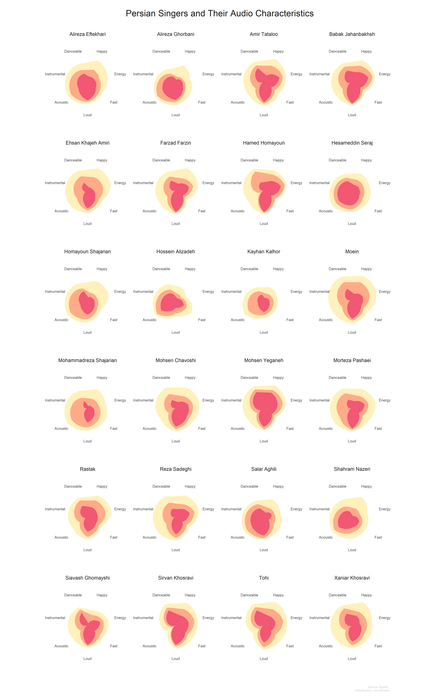
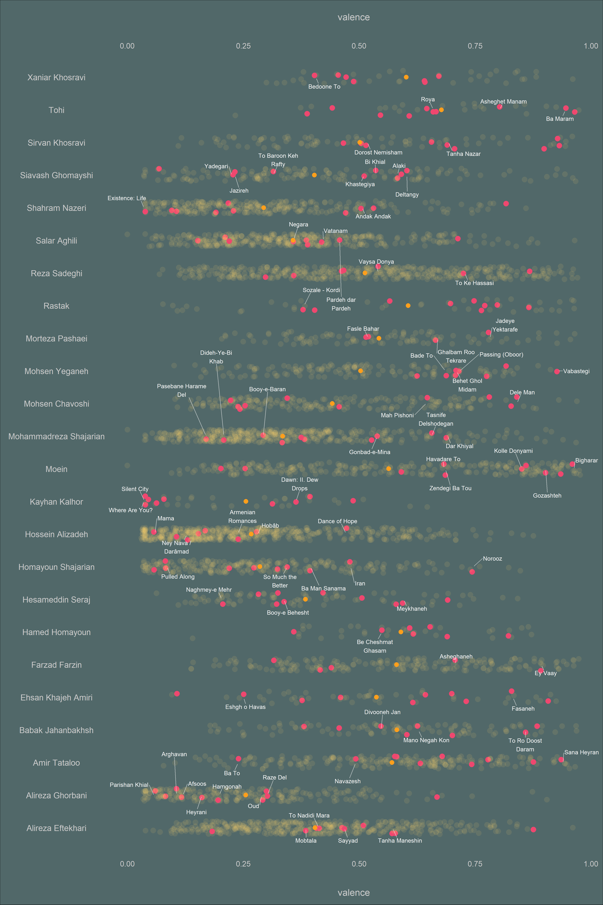
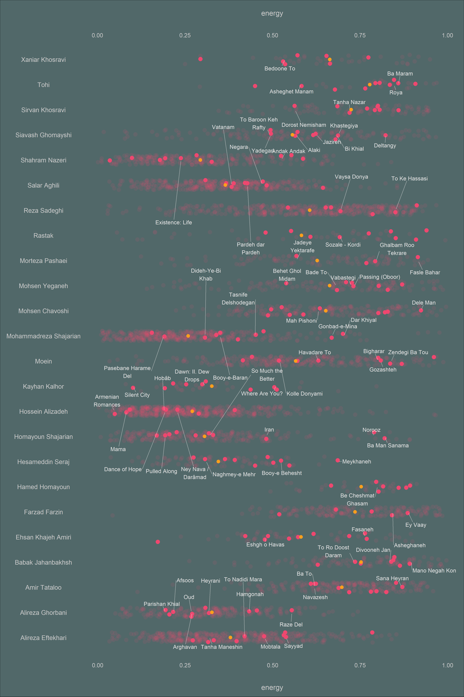
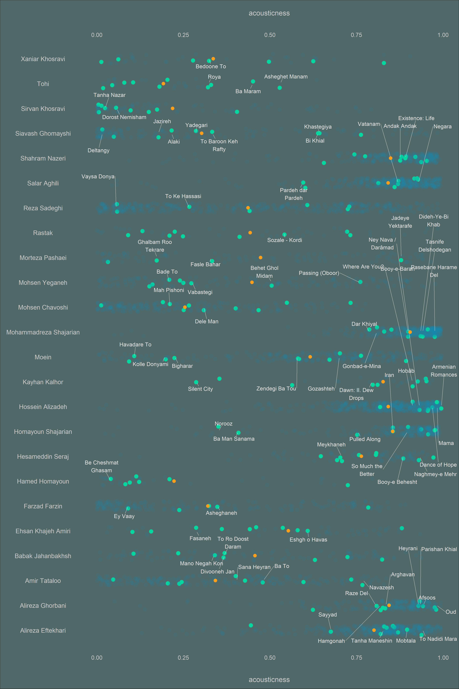
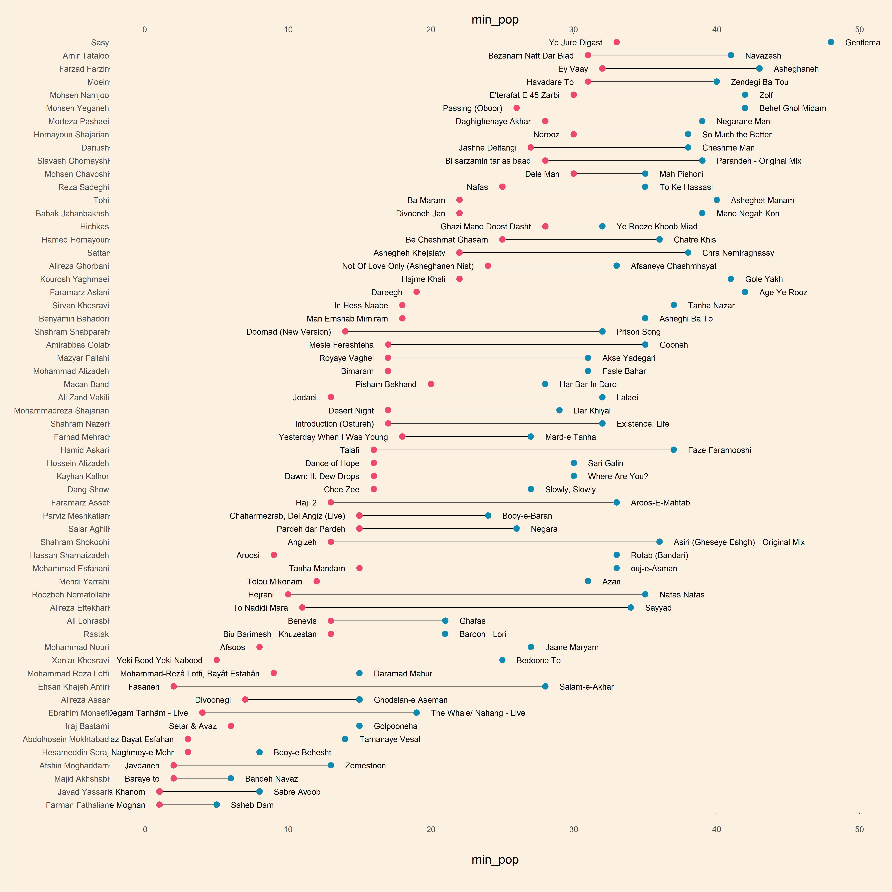

### Introduction


I am a music lover, and like my other hobbies, I am really interested in applying data science methods to it. A few months ago, I participated in the third week of the TidyTuesday project, where I made a map of Spotify songs based on audio features and a dimensionality reduction algorithm called UMAP. Since then, I have been using Spotify's Web API to collect data, and recently, I decided to look at some of my favorite Iranian artists and their songs on Spotify. We have different genres and types of music, and while pop and rap are very popular among the younger generation, I like the traditional style more. Nevertheless, I was always curious to understand how different traditional music and pop music are. For this reason,  that I like the most These are a few questions that I would like to answer:

1. How different audio features can be among top Persian singers?
2. What are the most danceable and least danceable Persian songs?
3. Who is the most popular Persian singer, and what is the most popular song?


```r
library(kableExtra)
library(tidyverse)
library(googlesheets4)
library(tidymodels)
library(gghighlight)
library(hrbrthemes)
library(ggthemes)
library(ggrepel)
library(ggalt)
library(extrafont)
library(ggtext)
library(ggforce)
library(cowplot)
```

## Data Collection

I compiled a list of Persian Singers manually and collected information about their available songs on Spotify using the ``spotifyr`` package in R which lets us use R to access the Spotify's API. This process was cumbersome as sometimes I was not getting what I was looking for. For instance, sometimes, songs that belonged to another random artist were retrieved. For each singer, we can only retrieve the top 10 popular songs. It means that the rest of the songs have no popularity scores. In the end, I collected various kinds of information about more than 10000 songs.


```r
songs_audio_plus_pop <- read_csv('https://raw.githubusercontent.com/mcnakhaee/datasets/master/Persian_Songs_Spotify.csv')

head(songs_audio_plus_pop) %>% 
  kable() %>%
  kable_styling(bootstrap_options = c("striped", "hover", "condensed", "responsive"))
```

<table class="table table-striped table-hover table-condensed table-responsive" style="margin-left: auto; margin-right: auto;">
 <thead>
  <tr>
   <th style="text-align:left;"> track_id </th>
   <th style="text-align:left;"> poet </th>
   <th style="text-align:left;"> lyrics </th>
   <th style="text-align:left;"> lyrics source </th>
   <th style="text-align:right;"> disc_number </th>
   <th style="text-align:right;"> duration_ms </th>
   <th style="text-align:left;"> explicit </th>
   <th style="text-align:left;"> track_name </th>
   <th style="text-align:left;"> track_name_farsi </th>
   <th style="text-align:left;"> artist_name </th>
   <th style="text-align:left;"> artist_name_farsi </th>
   <th style="text-align:right;"> popularity </th>
   <th style="text-align:right;"> track_number </th>
   <th style="text-align:left;"> album_href </th>
   <th style="text-align:left;"> album_id </th>
   <th style="text-align:left;"> album_name </th>
   <th style="text-align:left;"> album_release_date </th>
   <th style="text-align:right;"> album_total_tracks </th>
   <th style="text-align:right;"> album_release_year </th>
   <th style="text-align:left;"> track_href </th>
   <th style="text-align:right;"> danceability </th>
   <th style="text-align:right;"> energy </th>
   <th style="text-align:right;"> key </th>
   <th style="text-align:right;"> loudness </th>
   <th style="text-align:right;"> mode </th>
   <th style="text-align:right;"> speechiness </th>
   <th style="text-align:right;"> acousticness </th>
   <th style="text-align:right;"> instrumentalness </th>
   <th style="text-align:right;"> liveness </th>
   <th style="text-align:right;"> valence </th>
   <th style="text-align:right;"> tempo </th>
   <th style="text-align:right;"> time_signature </th>
   <th style="text-align:left;"> key_name </th>
   <th style="text-align:left;"> mode_name </th>
   <th style="text-align:left;"> key_mode </th>
   <th style="text-align:left;"> artist_id </th>
   <th style="text-align:left;"> lyrics_1 </th>
   <th style="text-align:left;"> poet_1 </th>
   <th style="text-align:left;"> lyric source </th>
   <th style="text-align:left;"> genre </th>
  </tr>
 </thead>
<tbody>
  <tr>
   <td style="text-align:left;"> 31iPeC6I0AiRW8InOxNKzm </td>
   <td style="text-align:left;"> NA </td>
   <td style="text-align:left;"> NA </td>
   <td style="text-align:left;"> NA </td>
   <td style="text-align:right;"> 1 </td>
   <td style="text-align:right;"> 446880 </td>
   <td style="text-align:left;"> FALSE </td>
   <td style="text-align:left;"> Ghazale Taze </td>
   <td style="text-align:left;"> NA </td>
   <td style="text-align:left;"> Salar Aghili </td>
   <td style="text-align:left;"> &lt;U+0633&gt;&lt;U+0627&gt;&lt;U+0644&gt;&lt;U+0627&gt;&lt;U+0631&gt; &lt;U+0639&gt;&lt;U+0642&gt;&lt;U+06CC&gt;&lt;U+0644&gt;&lt;U+06CC&gt; </td>
   <td style="text-align:right;"> NA </td>
   <td style="text-align:right;"> 1 </td>
   <td style="text-align:left;"> NA </td>
   <td style="text-align:left;"> 6GcmAWrnnMb2BuVriPhBLa </td>
   <td style="text-align:left;"> Va Eshgh Amad </td>
   <td style="text-align:left;"> 2020-02-03 </td>
   <td style="text-align:right;"> NA </td>
   <td style="text-align:right;"> 2020 </td>
   <td style="text-align:left;"> https://api.spotify.com/v1/tracks/31iPeC6I0AiRW8InOxNKzm </td>
   <td style="text-align:right;"> 0.437 </td>
   <td style="text-align:right;"> 0.390 </td>
   <td style="text-align:right;"> 0 </td>
   <td style="text-align:right;"> -7.170 </td>
   <td style="text-align:right;"> 0 </td>
   <td style="text-align:right;"> 0.0299 </td>
   <td style="text-align:right;"> 0.839 </td>
   <td style="text-align:right;"> 3.51e-05 </td>
   <td style="text-align:right;"> 0.1360 </td>
   <td style="text-align:right;"> 0.330 </td>
   <td style="text-align:right;"> 131.913 </td>
   <td style="text-align:right;"> 3 </td>
   <td style="text-align:left;"> C </td>
   <td style="text-align:left;"> minor </td>
   <td style="text-align:left;"> C minor </td>
   <td style="text-align:left;"> NA </td>
   <td style="text-align:left;"> NA </td>
   <td style="text-align:left;"> NA </td>
   <td style="text-align:left;"> NA </td>
   <td style="text-align:left;"> NA </td>
  </tr>
  <tr>
   <td style="text-align:left;"> 4Fi46ha8teWYTwk0b8fNPi </td>
   <td style="text-align:left;"> NA </td>
   <td style="text-align:left;"> NA </td>
   <td style="text-align:left;"> NA </td>
   <td style="text-align:right;"> 1 </td>
   <td style="text-align:right;"> 851920 </td>
   <td style="text-align:left;"> FALSE </td>
   <td style="text-align:left;"> Ayeeneye Hosn </td>
   <td style="text-align:left;"> NA </td>
   <td style="text-align:left;"> Salar Aghili </td>
   <td style="text-align:left;"> &lt;U+0633&gt;&lt;U+0627&gt;&lt;U+0644&gt;&lt;U+0627&gt;&lt;U+0631&gt; &lt;U+0639&gt;&lt;U+0642&gt;&lt;U+06CC&gt;&lt;U+0644&gt;&lt;U+06CC&gt; </td>
   <td style="text-align:right;"> NA </td>
   <td style="text-align:right;"> 2 </td>
   <td style="text-align:left;"> NA </td>
   <td style="text-align:left;"> 6GcmAWrnnMb2BuVriPhBLa </td>
   <td style="text-align:left;"> Va Eshgh Amad </td>
   <td style="text-align:left;"> 2020-02-03 </td>
   <td style="text-align:right;"> NA </td>
   <td style="text-align:right;"> 2020 </td>
   <td style="text-align:left;"> https://api.spotify.com/v1/tracks/4Fi46ha8teWYTwk0b8fNPi </td>
   <td style="text-align:right;"> 0.379 </td>
   <td style="text-align:right;"> 0.146 </td>
   <td style="text-align:right;"> 5 </td>
   <td style="text-align:right;"> -10.008 </td>
   <td style="text-align:right;"> 1 </td>
   <td style="text-align:right;"> 0.0414 </td>
   <td style="text-align:right;"> 0.970 </td>
   <td style="text-align:right;"> 3.60e-04 </td>
   <td style="text-align:right;"> 0.0812 </td>
   <td style="text-align:right;"> 0.346 </td>
   <td style="text-align:right;"> 105.634 </td>
   <td style="text-align:right;"> 4 </td>
   <td style="text-align:left;"> F </td>
   <td style="text-align:left;"> major </td>
   <td style="text-align:left;"> F major </td>
   <td style="text-align:left;"> NA </td>
   <td style="text-align:left;"> NA </td>
   <td style="text-align:left;"> NA </td>
   <td style="text-align:left;"> NA </td>
   <td style="text-align:left;"> NA </td>
  </tr>
  <tr>
   <td style="text-align:left;"> 0lQAe6EslKA7CUsS7SCW6Q </td>
   <td style="text-align:left;"> NA </td>
   <td style="text-align:left;"> NA </td>
   <td style="text-align:left;"> NA </td>
   <td style="text-align:right;"> 1 </td>
   <td style="text-align:right;"> 293160 </td>
   <td style="text-align:left;"> FALSE </td>
   <td style="text-align:left;"> Tarke Eshgh </td>
   <td style="text-align:left;"> NA </td>
   <td style="text-align:left;"> Salar Aghili </td>
   <td style="text-align:left;"> &lt;U+0633&gt;&lt;U+0627&gt;&lt;U+0644&gt;&lt;U+0627&gt;&lt;U+0631&gt; &lt;U+0639&gt;&lt;U+0642&gt;&lt;U+06CC&gt;&lt;U+0644&gt;&lt;U+06CC&gt; </td>
   <td style="text-align:right;"> NA </td>
   <td style="text-align:right;"> 3 </td>
   <td style="text-align:left;"> NA </td>
   <td style="text-align:left;"> 6GcmAWrnnMb2BuVriPhBLa </td>
   <td style="text-align:left;"> Va Eshgh Amad </td>
   <td style="text-align:left;"> 2020-02-03 </td>
   <td style="text-align:right;"> NA </td>
   <td style="text-align:right;"> 2020 </td>
   <td style="text-align:left;"> https://api.spotify.com/v1/tracks/0lQAe6EslKA7CUsS7SCW6Q </td>
   <td style="text-align:right;"> 0.437 </td>
   <td style="text-align:right;"> 0.453 </td>
   <td style="text-align:right;"> 5 </td>
   <td style="text-align:right;"> -5.392 </td>
   <td style="text-align:right;"> 0 </td>
   <td style="text-align:right;"> 0.0349 </td>
   <td style="text-align:right;"> 0.664 </td>
   <td style="text-align:right;"> 2.07e-03 </td>
   <td style="text-align:right;"> 0.1100 </td>
   <td style="text-align:right;"> 0.501 </td>
   <td style="text-align:right;"> 94.651 </td>
   <td style="text-align:right;"> 5 </td>
   <td style="text-align:left;"> F </td>
   <td style="text-align:left;"> minor </td>
   <td style="text-align:left;"> F minor </td>
   <td style="text-align:left;"> NA </td>
   <td style="text-align:left;"> NA </td>
   <td style="text-align:left;"> NA </td>
   <td style="text-align:left;"> NA </td>
   <td style="text-align:left;"> NA </td>
  </tr>
  <tr>
   <td style="text-align:left;"> 6dAFmJdVsKk5ksCpGqnKgO </td>
   <td style="text-align:left;"> NA </td>
   <td style="text-align:left;"> NA </td>
   <td style="text-align:left;"> NA </td>
   <td style="text-align:right;"> 1 </td>
   <td style="text-align:right;"> 648720 </td>
   <td style="text-align:left;"> FALSE </td>
   <td style="text-align:left;"> Moghbacheye Bade Foroosh </td>
   <td style="text-align:left;"> NA </td>
   <td style="text-align:left;"> Salar Aghili </td>
   <td style="text-align:left;"> &lt;U+0633&gt;&lt;U+0627&gt;&lt;U+0644&gt;&lt;U+0627&gt;&lt;U+0631&gt; &lt;U+0639&gt;&lt;U+0642&gt;&lt;U+06CC&gt;&lt;U+0644&gt;&lt;U+06CC&gt; </td>
   <td style="text-align:right;"> NA </td>
   <td style="text-align:right;"> 4 </td>
   <td style="text-align:left;"> NA </td>
   <td style="text-align:left;"> 6GcmAWrnnMb2BuVriPhBLa </td>
   <td style="text-align:left;"> Va Eshgh Amad </td>
   <td style="text-align:left;"> 2020-02-03 </td>
   <td style="text-align:right;"> NA </td>
   <td style="text-align:right;"> 2020 </td>
   <td style="text-align:left;"> https://api.spotify.com/v1/tracks/6dAFmJdVsKk5ksCpGqnKgO </td>
   <td style="text-align:right;"> 0.488 </td>
   <td style="text-align:right;"> 0.138 </td>
   <td style="text-align:right;"> 2 </td>
   <td style="text-align:right;"> -12.287 </td>
   <td style="text-align:right;"> 0 </td>
   <td style="text-align:right;"> 0.0451 </td>
   <td style="text-align:right;"> 0.915 </td>
   <td style="text-align:right;"> 6.58e-03 </td>
   <td style="text-align:right;"> 0.2120 </td>
   <td style="text-align:right;"> 0.445 </td>
   <td style="text-align:right;"> 110.967 </td>
   <td style="text-align:right;"> 5 </td>
   <td style="text-align:left;"> D </td>
   <td style="text-align:left;"> minor </td>
   <td style="text-align:left;"> D minor </td>
   <td style="text-align:left;"> NA </td>
   <td style="text-align:left;"> NA </td>
   <td style="text-align:left;"> NA </td>
   <td style="text-align:left;"> NA </td>
   <td style="text-align:left;"> NA </td>
  </tr>
  <tr>
   <td style="text-align:left;"> 4VSDJGyEdSMB8UL4fDSCvv </td>
   <td style="text-align:left;"> NA </td>
   <td style="text-align:left;"> NA </td>
   <td style="text-align:left;"> NA </td>
   <td style="text-align:right;"> 1 </td>
   <td style="text-align:right;"> 273480 </td>
   <td style="text-align:left;"> FALSE </td>
   <td style="text-align:left;"> Bigharar </td>
   <td style="text-align:left;"> NA </td>
   <td style="text-align:left;"> Salar Aghili </td>
   <td style="text-align:left;"> &lt;U+0633&gt;&lt;U+0627&gt;&lt;U+0644&gt;&lt;U+0627&gt;&lt;U+0631&gt; &lt;U+0639&gt;&lt;U+0642&gt;&lt;U+06CC&gt;&lt;U+0644&gt;&lt;U+06CC&gt; </td>
   <td style="text-align:right;"> NA </td>
   <td style="text-align:right;"> 5 </td>
   <td style="text-align:left;"> NA </td>
   <td style="text-align:left;"> 6GcmAWrnnMb2BuVriPhBLa </td>
   <td style="text-align:left;"> Va Eshgh Amad </td>
   <td style="text-align:left;"> 2020-02-03 </td>
   <td style="text-align:right;"> NA </td>
   <td style="text-align:right;"> 2020 </td>
   <td style="text-align:left;"> https://api.spotify.com/v1/tracks/4VSDJGyEdSMB8UL4fDSCvv </td>
   <td style="text-align:right;"> 0.301 </td>
   <td style="text-align:right;"> 0.443 </td>
   <td style="text-align:right;"> 0 </td>
   <td style="text-align:right;"> -5.702 </td>
   <td style="text-align:right;"> 0 </td>
   <td style="text-align:right;"> 0.0334 </td>
   <td style="text-align:right;"> 0.657 </td>
   <td style="text-align:right;"> 8.50e-06 </td>
   <td style="text-align:right;"> 0.1200 </td>
   <td style="text-align:right;"> 0.410 </td>
   <td style="text-align:right;"> 148.053 </td>
   <td style="text-align:right;"> 1 </td>
   <td style="text-align:left;"> C </td>
   <td style="text-align:left;"> minor </td>
   <td style="text-align:left;"> C minor </td>
   <td style="text-align:left;"> NA </td>
   <td style="text-align:left;"> NA </td>
   <td style="text-align:left;"> NA </td>
   <td style="text-align:left;"> NA </td>
   <td style="text-align:left;"> NA </td>
  </tr>
  <tr>
   <td style="text-align:left;"> 1tqsOZ3fGtMXL0r2ySBpvA </td>
   <td style="text-align:left;"> NA </td>
   <td style="text-align:left;"> NA </td>
   <td style="text-align:left;"> NA </td>
   <td style="text-align:right;"> 1 </td>
   <td style="text-align:right;"> 260754 </td>
   <td style="text-align:left;"> FALSE </td>
   <td style="text-align:left;"> Negar </td>
   <td style="text-align:left;"> NA </td>
   <td style="text-align:left;"> Salar Aghili </td>
   <td style="text-align:left;"> &lt;U+0633&gt;&lt;U+0627&gt;&lt;U+0644&gt;&lt;U+0627&gt;&lt;U+0631&gt; &lt;U+0639&gt;&lt;U+0642&gt;&lt;U+06CC&gt;&lt;U+0644&gt;&lt;U+06CC&gt; </td>
   <td style="text-align:right;"> NA </td>
   <td style="text-align:right;"> 1 </td>
   <td style="text-align:left;"> NA </td>
   <td style="text-align:left;"> 09Hepb4NioQ6sO87tsDyiz </td>
   <td style="text-align:left;"> Negar </td>
   <td style="text-align:left;"> 2019-10-30 </td>
   <td style="text-align:right;"> NA </td>
   <td style="text-align:right;"> 2019 </td>
   <td style="text-align:left;"> https://api.spotify.com/v1/tracks/1tqsOZ3fGtMXL0r2ySBpvA </td>
   <td style="text-align:right;"> 0.577 </td>
   <td style="text-align:right;"> 0.366 </td>
   <td style="text-align:right;"> 0 </td>
   <td style="text-align:right;"> -6.668 </td>
   <td style="text-align:right;"> 0 </td>
   <td style="text-align:right;"> 0.0368 </td>
   <td style="text-align:right;"> 0.834 </td>
   <td style="text-align:right;"> 3.90e-06 </td>
   <td style="text-align:right;"> 0.1110 </td>
   <td style="text-align:right;"> 0.367 </td>
   <td style="text-align:right;"> 77.453 </td>
   <td style="text-align:right;"> 3 </td>
   <td style="text-align:left;"> C </td>
   <td style="text-align:left;"> minor </td>
   <td style="text-align:left;"> C minor </td>
   <td style="text-align:left;"> NA </td>
   <td style="text-align:left;"> NA </td>
   <td style="text-align:left;"> NA </td>
   <td style="text-align:left;"> NA </td>
   <td style="text-align:left;"> NA </td>
  </tr>
</tbody>
</table>

### Overall Song Features

Apart from variables such as the album that a song belongs to and its date of release, Spotify's API can give us several features that capture a song's different audio characteristics.

You can see a full list of these features in this link. However, I am only interested in some of these features, such as:

- **valence** measures the happiness of a song.
- **energy** is relatively self-explanatory.
- **tempo** measures the speed of a song.
- **loudness** is also self-explanatory.
- **acousticness** identifies whether the track is acoustic
- **instrumentalness** shows whether a track contains no vocals.
- **danceability** determines how good a song is for dancing.

[This excellent visualization](https://github.com/jakelawlor/TidyTuesday_JL/blob/master/CodeFiles/Jan21.20.Spotify.Rmd) inspired me to create a similar plot for some of the most well-known Persian singers and see how their audio features differ from each other.


```r
artists <-
  c( 'Sirvan Khosravi','Hesameddin Seraj','Rastak','Shahram Nazeri','Hossein Alizadeh','Reza Sadeghi','Alireza Eftekhari','Mohammadreza Shajarian',
     'Salar Aghili','Morteza Pashaei', 'Alireza Ghorbani','Homayoun Shajarian', 'Mohsen Yeganeh' ,'Morteza Pashaei','Moein','Farzad Farzin',
     'Babak Jahanbakhsh', 'Ehsan Khajeh Amiri','Siavash Ghomayshi','Xaniar Khosravi','Tohi' ,'Mohsen Chavoshi','Amir Tataloo',
     'Hamed Homayoun','Kayhan Kalhor')
```


I will plot the average, the minimum, and the maximum value of each feature for each singer. That gives us a good picture of how different their audio characteristics are from each other. However, we must make the right adjustments to the dataset before visualizing it:

1.  We need to transform the original dataset into a long-dataframe, which can be done by ``pivot_longer`` from the``dplyr`` package.

2. We should rescale each audio feature, otherwise, the plot would not make any sense.


```r
order <- c(
  "valence",
  "energy",
  "tempo",
  "loudness",
  "acousticness",
  "instrumentalness",
  "danceability"
)

scaled_features_long <- songs_audio_plus_pop %>%
  mutate_at(order, scales::rescale, to = c(0, 7)) %>%
  filter(!is.na(popularity)) %>%
  filter(artist_name %in% artists) %>%
  mutate(artist_name = factor(artist_name))  %>%
  pivot_longer(
    names_to = 'metric',
    cols = c(
      "valence",
      "energy",
      "tempo",
      "loudness",
      "acousticness",
      "danceability"),
    values_to = 'value') 
```


Now, we can visualize the results for each artist. As mentioned before, I will compare artists by the minimum (red), the average (orange), and maximum (yellow) values of each audio feature in their songs.


```r
ggplot() +
  ### This plots the average of each audio feature
  geom_polygon(
    data = scaled_features_long %>%  group_by(artist_name, metric) %>%
      summarise_at(c("value"), mean) %>%
      arrange(factor(metric, levels = order)) %>%
      ungroup(),
    aes(x = metric, y = value, group = artist_name,),
    alpha = .54,
    size = 1.5,
    show.legend = T,
    fill = '#FF1654'
  ) +
  ### This plots the maximum of each audio feature
  geom_polygon(
    data = scaled_features_long %>%  group_by(artist_name, metric) %>%
      summarise_at(c("value"), max) %>%
      arrange(factor(metric, levels = order)) %>%
      ungroup(),
    aes(x = metric, y = value, group = artist_name,),
    alpha = .44,
    size = 1.5,
    show.legend = T,
    fill = '#FFE066'
  ) +
  ### This plots the mimumn of each audio feature
  geom_polygon(
    data = scaled_features_long %>%  group_by(artist_name, metric) %>%
      summarise_at(c("value"), min) %>%
      arrange(factor(metric, levels = order)) %>%
      ungroup(),
    aes(x = metric, y = value, group = artist_name,),
    alpha = .84,
    size = 1.5,
    show.legend = T,
    fill =  "#EF476F"
  ) +
  scale_x_discrete(
    limits = order,
    labels = c(
      "Happy",
      "Energy",
      "Fast",
      "Loud",
      "Acoustic",
      "Instrumental",
      "Danceable"
    )
  ) +
  coord_polar(clip = 'off') +
  theme_minimal() +
  labs(title = "Persian Singers and Their Audio Characteristics",
       caption = 'Source: Spotify \n Visualization: mcnakhaee') +
  ylim(0, 8) +
  facet_wrap( ~ artist_name, ncol = 4) +
  theme(
    axis.title = element_blank(),
    axis.ticks = element_blank(),
    axis.text.y = element_blank(),
    axis.text.x = element_text(
      family =  'Montserrat',
      size = 13.5,
      margin = ggplot2::margin(30, 0, 20, 0)
    ),
    plot.caption = element_text(
      family = 'Montserrat',
      margin = ggplot2::margin(30, 0, 20, 0),
      size = 11,
      color = 'grey80'
    ) ,
    text = element_text(family =  'Montserrat'),
    strip.text = element_text(family =  'Montserrat', size = 18),
    strip.text.x = element_text(margin = ggplot2::margin(1, 1, 1, 1, "cm")),
    panel.spacing = unit(3.5, "lines"),
    panel.grid = element_blank(),
    plot.title = element_text(
      family = 'Montserrat',
      hjust = .5,
      margin = ggplot2::margin(30, 0, 20, 0),
      size = 32,
      color = 'gray10'
    )
  )
```




### Looking more closely at each audio feature

My first plot is informative, but it only gives us an overall picture of audio features. However, I would like to have a more detailed picture of singers and the audio features for each of their songs.  For this reason, I  will also make a separate plot for each audio feature where every song and its corresponding feature values are shown.  I will also mark a few popular songs from each artist with a different color on this plot.


```r
# Set a custom theme for our plots
theme_set(theme_void() +
  theme(
    text = element_text(family =  'Montserrat'),
    axis.text.x = element_text(
      family = 'Montserrat',
      margin = ggplot2::margin(30, 0, 20, 0),
      color = 'gray80',
      size = 18
    ),
    axis.text.y = element_text(
      family = 'Montserrat',
      margin = ggplot2::margin(30, 0, 20, 20),
      color = 'gray80',
      size = 20
    ),
    axis.title.x = element_text(
      family = 'Montserrat',
      margin = ggplot2::margin(30, 0, 20, 0),
      size = 22,
      color = 'gray80'
    ),
    plot.title = element_text(
      family = 'Montserrat',
      hjust = .5,
      margin = ggplot2::margin(40, 0, 40, 0),
      size = 35,
      color = 'gray80'
    ),
    plot.caption = element_text(family ='Montserrat',
                                  margin = ggplot2::margin(30, 0, 20, 20),
                                      size = 20,
                                  color = 'gray70') ,
    legend.position = 'none',
    plot.background = element_rect(fill = "#516869")
  ))
```


Again here, I will change the dataset to make it ready for visualization. 


```r
songs_audio_plus_pop_jitter <- songs_audio_plus_pop %>% 
  filter(artist_name %in% artists) %>% 
  mutate(is_popular = !is.na(popularity)) %>%
  distinct(artist_name,track_name,.keep_all = T) %>% 
  mutate(is_popular_size = if_else(!is.na(popularity),popularity,25),
         is_popular_alpha = if_else(!is.na(popularity),0.8,0.5)) %>% 
  mutate(track_name= str_wrap(track_name, width = 15)) %>% 
  mutate(popular_track_name = if_else(!is.na(track_name_farsi)& !is.na(popularity) & nchar(track_name) < 20 & !explicit,track_name,'')) 
```

### Happiness


```r
songs_audio_plus_pop_jitter %>%
  ggplot(aes(x = artist_name, y = valence)) +
  geom_jitter(
    aes(
      color = is_popular,
      size = is_popular_size,
      alpha = is_popular_alpha
    ),
    size = 6,
    width = 0.2,
  ) +
  geom_text_repel(
    aes(label = popular_track_name , x = artist_name , y = valence),
    family = 'Montserrat',
    color = 'gray99',
    size = 5,
    force = 0.6,
    max.iter = 2000,
    box.padding = 0.4,
    point.padding = 0.6,
    min.segment.length = 0.15,
    nudge_y      = 0.001,
    hjust = 0.5,
    segment.alpha = 0.6,
    segment.size = 0.6
  ) +
  stat_summary(
    fun = mean,
    geom = 'point',
    color = '#FF9F1C',
    size = 5,
    aes(group = artist_name)) +
  scale_color_manual(values = c('#FFD166', '#EF476F')) +
  scale_y_continuous(sec.axis = dup_axis()) +
  coord_flip()
```




### Energy


```r
songs_audio_plus_pop_jitter %>%
  ggplot(aes(x = artist_name, y = energy)) +
  geom_jitter(
    aes(
      color = is_popular,
      size = is_popular_size,
      alpha = is_popular_alpha
    ),
    size = 6,
    width = 0.2,
  ) +
  geom_text_repel(
    aes(label = popular_track_name , x = artist_name , y = energy),
    family = 'Montserrat',
    color = 'gray90',
    size = 6,
    force = 0.6,
    max.iter = 2000,
    box.padding = 0.4,
    point.padding = 0.6,
    min.segment.length = 0.15,
    nudge_y      = 0.001,
    hjust = 0.5,
    segment.alpha = 0.6,
    segment.size = 0.6
  ) +
  stat_summary(
    fun = mean,
    geom = 'point',
    color = '#FF9F1C',
    size = 5,
    aes(group = artist_name)
  ) +
  scale_color_manual(values = c('#EF476F', '#EF476F')) +
  scale_y_continuous(sec.axis = dup_axis()) +
  coord_flip() 
```




### Acousticness


```r
songs_audio_plus_pop_jitter %>%
  ggplot(aes(x = artist_name, y = acousticness)) +
  geom_jitter(
    aes(
      color = is_popular,
      size = is_popular_size,
      alpha = is_popular_alpha
    ),
    size = 6,
    width = 0.2,
  ) +
  geom_text_repel(
    aes(label = popular_track_name , x = artist_name , y = acousticness),
    family = 'Montserrat',
    color = 'gray90',
    size = 6,
    force = 0.6,
    max.iter = 2000,
    box.padding = 0.4,
    point.padding = 0.6,
    min.segment.length = 0.15,
    nudge_y      = 0.001,
    hjust = 0.5,
    segment.alpha = 0.6,
    segment.size = 0.6
  ) +
  stat_summary(
    fun = mean,
    geom = 'point',
    color = '#FF9F1C',
    size = 5,
    aes(group = artist_name)
  ) +
  scale_color_manual(values = c('#118AB2', '#06D6A0')) +
  scale_y_continuous(sec.axis = dup_axis()) +
  coord_flip() 
```



### Danceability


```r
songs_audio_plus_pop_jitter %>%
  ggplot(aes(x = artist_name, y = danceability)) +
  geom_jitter(
    aes(
      color = is_popular,
      size = is_popular_size,
      alpha = is_popular_alpha
    ),
    size = 6,
    width = 0.2,
  ) +
  geom_text_repel(
    aes(label = popular_track_name , x = artist_name , y = danceability),
    family = 'Montserrat',
    color = 'gray90',
    size = 6,
    force = 0.6,
    max.iter = 2000,
    box.padding = 0.4,
    point.padding = 0.6,
    min.segment.length = 0.15,
    nudge_y      = 0.001,
    hjust = 0.5,
    segment.alpha = 0.6,
    segment.size = 0.6
  ) +
  stat_summary(
    fun = mean,
    geom = 'point',
    color = '#FF9F1C',
    size = 5,
    aes(group = artist_name)
  ) +
  scale_color_manual(values = c('#A5668B', '#EF476F')) +
  scale_y_continuous(sec.axis = dup_axis()) +
  coord_flip()
```


### Loudness


```r
songs_audio_plus_pop_jitter %>%
  ggplot(aes(x = artist_name, y = loudness)) +
  geom_jitter(
    aes(
      color = is_popular,
      size = is_popular_size,
      alpha = is_popular_alpha
    ),
    size = 6,
    width = 0.2,
    
  ) +
  geom_text_repel(
    aes(label = popular_track_name , x = artist_name , y = loudness),
    family = 'Montserrat',
    color = 'gray90',
    size = 6,
    force = 0.6,
    max.iter = 2000,
    box.padding = 0.4,
    point.padding = 0.6,
    min.segment.length = 0.15,
    nudge_y      = 0.001,
    hjust = 0.5,
    segment.alpha = 0.6,
    segment.size = 0.6
  ) +
  stat_summary(
    fun = mean,
    geom = 'point',
    color = '#FF9F1C',
    size = 5,
    aes(group = artist_name)
  ) +
  scale_color_manual(values = c('#06D6A0', '#EF476F')) +
  scale_y_continuous(sec.axis = dup_axis()) +
  coord_flip() 
```


## Most Popular Songs

As I mentioned previously, we can only retrieve his/her top 10 popular songs for each artist. The popularity of a track is a value between 0 (the least popular) and 100 (the most popular). Spotify uses an algorithm to calculate popularity scores, which is heavily influenced by the total number of times a song has been played recently. You can read more about it in this [link](https://developer.spotify.com/documentation/web-api/reference/tracks/get-track/). 

Knowing this fact about how popularity is measured, we can visualize songs and artists that have been popular and played recently.


```r
songs_audio_plus_pop <- songs_audio_plus_pop %>%
  filter(
    !artist_name %in% c(
      'Hatam Asgari',
      'Kaveh Deylami',
      'Nasser Abdollahi',
      'Peyman Yazdanian',
      'Abbas Ghaderi',
      'Mohammad Golriz',
      'Hamid Hami',
      'Koveyti Poor',
      'Mohsen Sharifian',
      'Soheil Nafissi'))
songs_audio_plus_pop %>%
  filter(!is.na(popularity)) %>%
  mutate(track_name = if_else(!is.na(track_name), track_name, track_name)) %>%
  group_by(artist_name) %>%
  summarize(
    avg_pop = mean(popularity),
    min_pop = min(popularity),
    max_pop = max(popularity),
    most_popular = track_name[which.max(popularity)],
    least_popular = track_name[which.min(popularity)]
  ) %>%
  mutate(
    artist_name = fct_reorder(artist_name, avg_pop),
  ) %>%
  
  ggplot(aes(x = min_pop , xend = max_pop, y = artist_name)) +
  geom_dumbbell(
    colour_x = '#ef476f',
    colour_xend = '#118ab2',
    size_x = 7,
    size_xend = 7
  ) +
  geom_text(
    aes(x = min_pop - 1, y = artist_name, label = least_popular),
    size = 7,
    family = 'Montserrat',
    hjust = 1
  ) +
  geom_text(
    aes(x = max_pop + 1, y = artist_name, label = most_popular),
    size = 7,
    family = 'Montserrat',
    hjust = 0
  ) +
  scale_x_continuous(sec.axis = dup_axis()) +
  theme_tufte() +
  theme(
    plot.title = element_text(
      family = 'Montserrat',
      hjust = .5,
      margin = ggplot2::margin(0, 0, 40, 0),
      size = 45
    ),
    plot.subtitle = element_markdown(
      family = 'Montserrat',
      size = 15,
      margin = ggplot2::margin(20, 0, 40, 0),
      hjust = 1
      
    ),
    axis.text.x = element_text(
      family = 'Montserrat',
      margin = ggplot2::margin(30, 0, 20, 0),
      size = 20
    ),
    
    axis.text.y = element_text(
      family = 'Montserrat',
      margin = ggplot2::margin(30, 0, 20, 0),
      size = 20
    ),
    axis.title.x = element_text(
      family = 'Montserrat',
      margin = ggplot2::margin(30, 0, 20, 0),
      size = 30
    ),
    plot.caption = element_text(family ='Montserrat',
                                margin = ggplot2::margin(30, 0, 20, 20),
                                size = 20,
                                color = 'gray20') ,
    axis.title.y = element_blank(),
    plot.background = element_rect(fill = '#FCF0E1'),
    plot.margin = unit(c(1, 1, 1.5, 1.2), "cm")
  )
```



This plot shows the most popular song and the least popular track of each artist among his top 10 songs. The artists are also sorted based on their average popularity.


