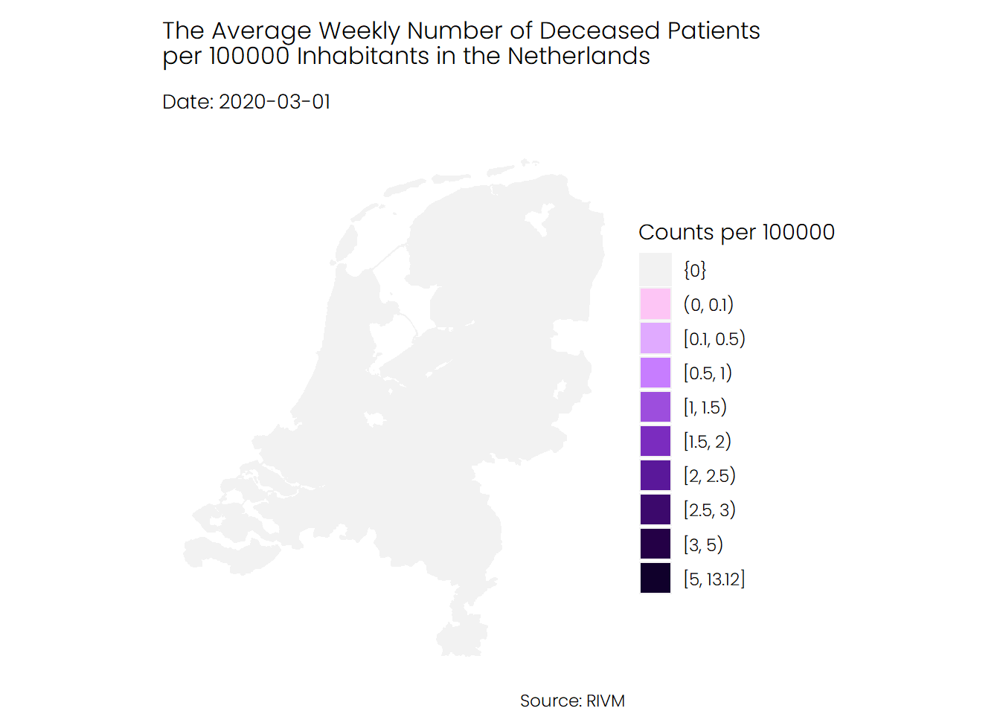

```{r message=FALSE, warning=FALSE, include=FALSE}
knitr::opts_chunk$set(
	echo = TRUE,
	message = FALSE,
	warning = FALSE,
	eval = TRUE
)
windowsFonts('Lobser' = 'Lobser')
windowsFonts('Poppins Light' = 'Poppins Light')

```

Two weeks ago, I made [a visualization](https://www.linkedin.com/posts/muhammadcnakhaee_covid19-datavisualization-ggplot-activity-6726775611223764992-c_dk) that shows how Covid-19 cases spread in the Netherlands from the beginning of March and how grim the situation looks. However, someone pointed out to the fact that the number of tests has increased significantly. It means that my plot may exaggerate the Covid-19 situation in the Netherlands. Unfortunately, I could not find testing data for each Dutch municipality. Instead, I decided to use hospitalization admission and deceased cases to see if we can indeed see a massive spread in the second wave of Covid-19 cases in the Netherlands.

```{r}
library(tidyverse)
library(CoronaWatchNL)
library(sf)
library(gganimate)
library(santoku)
library(lubridate)
library(gghighlight)
library(geofacet)
library(foreign)
theme_set(theme_void())
theme_update(
  #plot.background = element_rect(fill = '#FDF6E3',color = '#FDF6E3'),
  text = element_text(family = 'Poppins Light'),
  plot.subtitle = element_text(
    family = 'Poppins Light',
    size = 10,
    margin = margin(b = 10)
  ),
  plot.title = element_text(
    family = 'Poppins Light',
    size = 12,
    margin = margin(t = 10, b = 10)
  )
)
```
I created an R package called [CoronaWarchNL](https://github.com/mcnakhaee/CoronaWatchNL) that allows you to access a wide range of Covid-19 datasets. I'll use this package in this post to get Covid-19 cases, hospital admissions, and deaths for Dutch municipalities. 

```{r warning=FALSE, message=FALSE}

municipalBoundaries <- st_read(
    "https://geodata.nationaalgeoregister.nl/cbsgebiedsindelingen/wfs?request=GetFeature&service=WFS&version=2.0.0&typeName=cbs_gemeente_2020_gegeneraliseerd&outputFormat=json"
  )


daily_cases_per_municpality <- get_daily_cases_per_municipality()
populatuon_per_region <- get_population_per_region()

daily_cases_per_municpality <- daily_cases_per_municpality %>%
  inner_join(populatuon_per_region, by = c('Municipality_name' = 'Regions')) %>%
  mutate(
    Date_of_publication = as_date(Date_of_publication),
    avg_daily_total_cases = 100000 * as.numeric(Total_reported) / as.numeric(`Bevolking op 1 januari (aantal)`),
    avg_daily_hospital_admissions = 100000 * as.numeric(Hospital_admission) / as.numeric(`Bevolking op 1 januari (aantal)`),
    avg_daily_deceased = 100000 * as.numeric(Deceased) / as.numeric(`Bevolking op 1 januari (aantal)`)
  )

```

I compute the weekly average number of Covid-19 cases, hospitalizations, and death per 100000 inhabitants in each municipality in the Netherlands. The following piece of code shows how I did this using R. 

```{r fig.height=10,fig.width=10}


weekly_cases <- daily_cases_per_municpality %>%
  mutate(week = round_date(Date_of_publication , unit = 'week'))

weekly_cases_per_municpality <- weekly_cases %>%
  group_by(Municipality_name, week) %>%
  summarise(
    avg_weekly_total_cases = mean(avg_daily_total_cases),
    avg_weekly_hospital_admissions = mean(avg_daily_hospital_admissions),
    avg_weekly_deceased = mean(avg_daily_deceased)) %>%
  ungroup() %>%
  mutate(
    d_avg_weekly_total_cases = chop(avg_weekly_total_cases, c(0, 0, 0.5, 1, 5, 12, 20, 35, 55, 80, 100)),
    d_avg_hospital_admissions = chop(
      avg_weekly_hospital_admissions,
      c(0, 0, 0.5, 1, 2, 3, 5, 7, 9, 10, 15)),
    d_avg_weekly_deceased = chop(avg_weekly_deceased, c(0, 0, 0.1, 0.5, 1, 1.5, 2, 2.5, 3, 5)))

data_weekly <- municipalBoundaries %>%
  right_join(weekly_cases_per_municpality,
             by = c(statnaam = "Municipality_name"))


```
I will create an animation that shows how Covid-19 cases spread in the Netherlands and which municipality were and are hit hardest by the pandemic.

```{r}
make_animation <- function(data, var_name, pal, title) {
  var_name <- rlang::enquo(var_name)
  data %>%
    #filter(week > '2020-10-01') %>%
    ggplot() +
    geom_sf(aes(fill = !!var_name), color = 'gray95') +
    scale_fill_manual(values  = pal) +
    coord_sf(datum = NA) +
    labs(
      title = title,
      subtitle = 'Date: {current_frame}',
      fill = 'Counts per 100000',
      caption = 'Source: RIVM'
    ) +
    transition_manual(week, cumulative = T) +
    ease_aes("sine") +
    enter_fade(alpha = 0.5) +
    exit_fade(alpha = 0.5)
}

```

The first animation shows the number of infections in each municipality, from the start of the pandemic in February until recently. As you can see, the second wave, which began in late September, looks really terrifying. Note that there are some municipalities that no data is available for them.
```{r eval=FALSE}
pal_cases <- c(
      'gray95',
      '#fee440',
      '#FFBA08',
      '#FAA307',
      '#F48C06',
      '#E85D04',
      '#DC2F02',
      '#D00000',
      '#9D0208',
      '#6A040F',
      '#370617',
      '#03071e'
    )
make_animation(data_weekly,d_avg_weekly_total_cases,pal_cases,'The Average Weekly Number of Covid-19 Cases\nper 100000 Inhabitants in the Netherlands')
```


If we look at the number of hospital admissions we see a different story.  It seems that the number of hospitalizations was higher during the first wave of Covid-19 compared to the second wave and mostly the southern parts of the Netherlands were hit harder than the rest of the Netherlands.

```{r eval=FALSE}
pal_patients <- c(
      'gray95',
      '#caf0f8',
      '#ade8f4',
      '#90e0ef',
      '#48cae4',
      '#00b4d8',
      '#0096c7',
      '#0077b6',
      '#023e8a',
      '#03045e',
      '#03071e'
)
make_animation(data_weekly,d_avg_hospital_admissions,pal_patients,'The Average Weekly Number of Hospital Admissions\nper 100000 Inhabitants in the Netherlands')
```


The trend for deceased patients looks similar to of the hospital admission. The average numb of death during the first wave of Corona was higher than the average number of death during the second wave. 

```{r eval=FALSE}
pal_deceased <- c(
      'gray95',
      '#fdc5f5',
     '#e0aaff',
      '#c77dff',
      '#9d4edd',
      '#7b2cbf',
      '#5a189a',
      '#3c096c',
      '#240046',
      '#10002b'

)
make_animation(data_weekly,d_avg_weekly_deceased,pal_deceased,'The Average Weekly Number of Deceased Patients\nper 100000 Inhabitants in the Netherlands')

```


These different animations show us two distinct trends. On the one hand, we can see the number of confirmed cases rose rapidly during the second wave to affect almost all regions. On the other hand, the number of hospitalizations and deaths during the second wave slightly decreased. This might suggest that the rise in the number of cases is mainly driven by an increase in the number of tests. Alternatively, the virus might have become less deadly and severe.

```{r fig.height=10,fig.width=10,eval=FALSE,include=FALSE}
weekly_cases %>%
  group_by(Province, week) %>%
  summarise(
    avg_weekly_hospital_admissions = mean(avg_daily_hospital_admissions),
    avg_weekly_deceased = mean(avg_daily_deceased)
  ) %>%
  rename(name = Province) %>%
  ggplot(aes(week, avg_weekly_hospital_admissions, color = name)) +
  geom_line(color = 'indianred', size = 1.5) +
  geom_point(color = 'indianred') +
  gghighlight(
    use_direct_label = FALSE,
    unhighlighted_params = list(
      size = 1.3,
      color = '#F6DAB4',
      alpha  = 0.5
    )
  ) +
  facet_geo( ~ name, grid = 'nl_prov_grid1') +
  theme_minimal()
```


```{r eval=FALSE, include=FALSE}
data_daily <- municipalBoundaries%>% 
  right_join(daily_cases_per_municpality ,by=c(statnaam="Municipality_name"))

,
    day = round_date(Date_of_publication , unit = 'day'),
    avg_daily_total_case = 100000 * as.numeric(Total_reported) / as.numeric(`Bevolking op 1 januari (aantal)`),
        avg_daily_hospital_admissions = 100000 * as.numeric(Hospital_admission) / as.numeric(`Bevolking op 1 januari (aantal)`),
    avg_daily_deceased = 100000 * as.numeric(Deceased) / as.numeric(`Bevolking op 1 januari (aantal)`),
    d_avg_daily_total_case = chop(avg_daily_total_case, c(0, 0, 0.5, 1, 5, 12, 20, 35, 55, 80, 100, 110)),
    d_avg_daily_hospital_admissions = chop(avg_daily_hospital_admissions, c(0, 0,1, 2,3, 5, 8, 10, 15, 20, 30, 60, 80)),
    d_avg_daily_deceased = chop(avg_daily_deceased, c(0, 0,0.5,1,1.5, 2, 2.5, 5,7.5, 10, 12.5, 15,20,25,30)),
  )

data %>%
  #filter(day > '2020-10-01') %>% 
  ggplot() +
  geom_sf(aes(fill = avg_daily_hospital_deceased), color = 'gray95') +
  scale_fill_manual(
    values  = c(
      'gray95',
      '#fee440',
      '#FFBA08',
      '#FAA307',
      '#F48C06',
      '#E85D04',
      '#DC2F02',
      '#D00000',
      '#9D0208',
      '#6A040F',
      '#370617',
      '#03071e',
      '#03071e'
    )
  ) +
  coord_sf(datum = NA) +
  labs(
    title = 'Covid-19 Cases per 100000 Inhabitants in the Netherlands',
    subtitle = 'Date: {current_frame}',
    fill = 'Counts per 100000',
    caption = 'Source: RIVM'
  ) +
  theme_void() +
  theme(
    text = element_text(family = 'Poppins Light'),
    plot.subtitle = element_text(
      family = 'Poppins Light',
      size = 13,
      margin = margin(b = 10)
    ) ,
    plot.title = element_text(
      family = 'Poppins Light',
      size = 15,
      margin = margin(t = 10, b = 10)
    )
  ) +
  transition_manual(day, cumulative = T) +
  ease_aes("sine") +
  enter_fade(alpha = 0.5) +
  exit_fade(alpha = 0.5)
```

