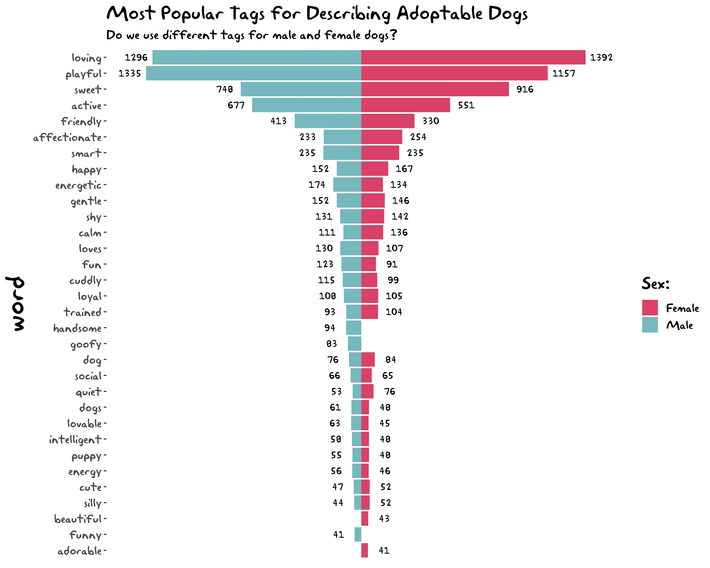

For 6 years, I had been using python exclusively as the main tool for carrying out my data science tasks and running my experiments. Recently, I have started using Tidyverse packages and tools in R for my data science activities. I am completely facinated by how these tools make it easy for me to perform analysis and create nice visualization. Since then I have tried to participate in the weekly Tidy Tuesday project.
You can find my submissions in this page. 

## 2020

### Week 3

## 2019

### Week 52 - Christmas Songs

### 

## Week 51 -Adoptable dogs

### Week 46 -  Code in CRAN Packages

## **Week 36 - Moore's Law**

## Week 35 - Simpsons Guest Stars

